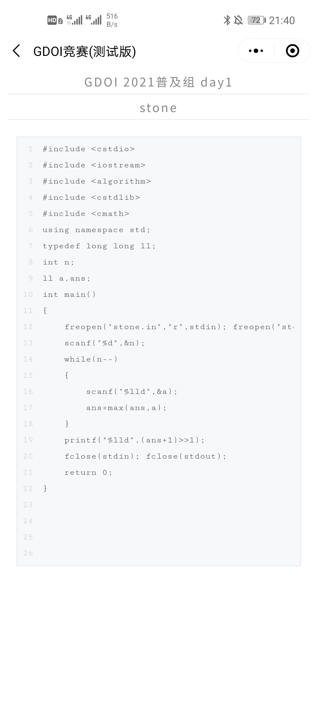
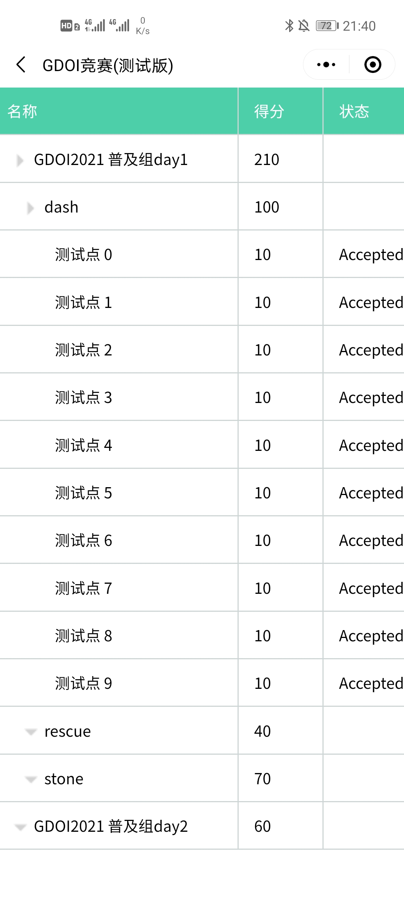
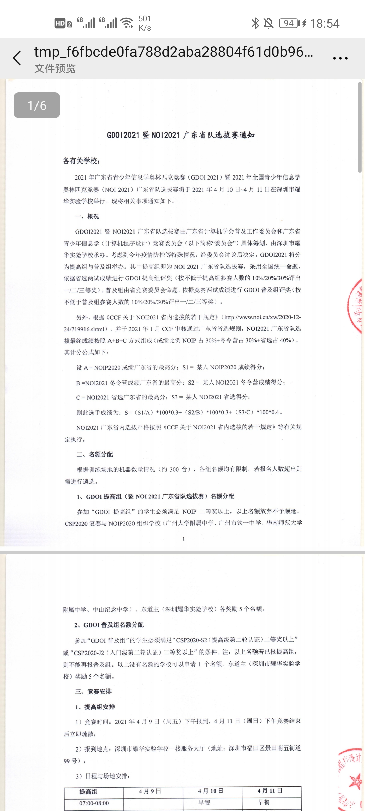
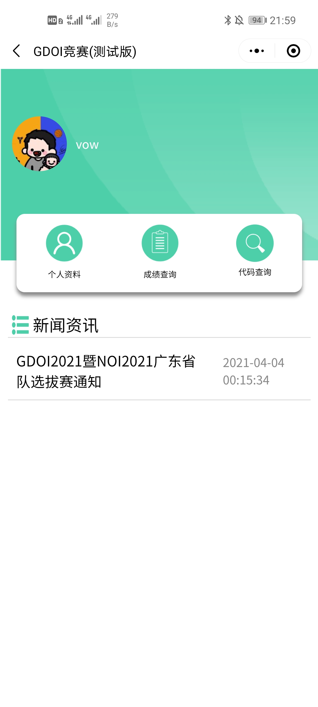
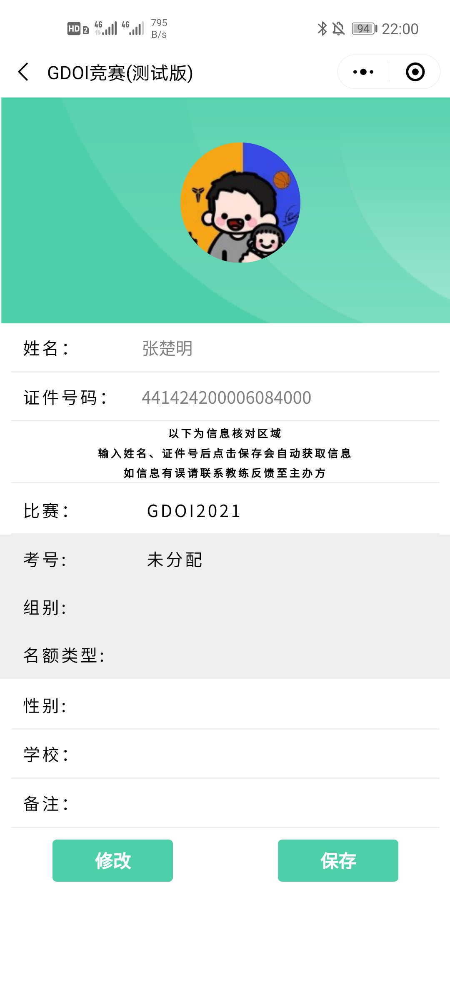
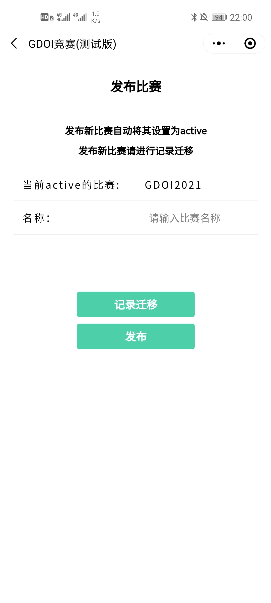
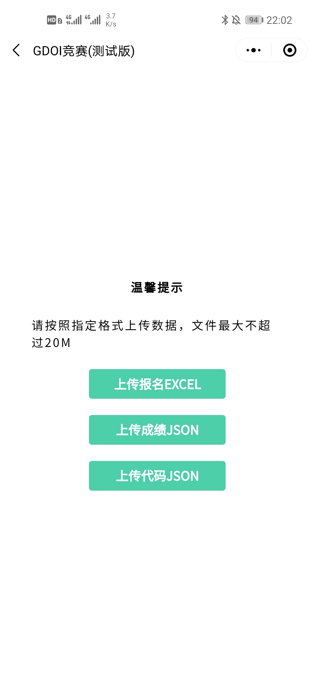
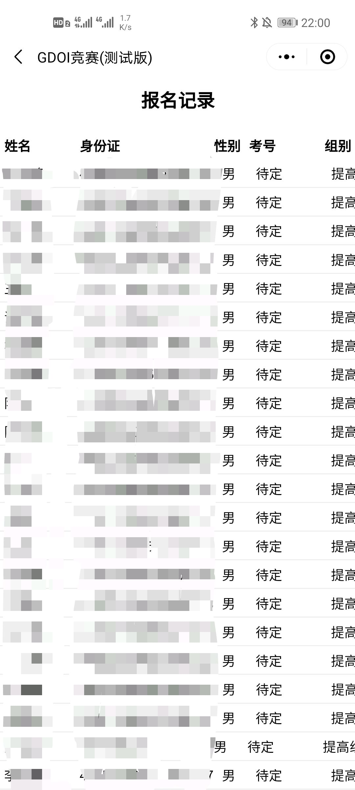
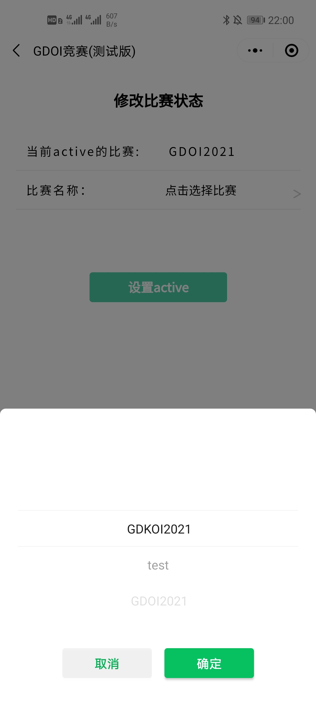

# 介绍文档

#### 程序设计报名系统小程序


## 作品综述

- 本小程序主要用于程序设计相关比赛的前期报名、发布相关新闻、上传比赛成绩和参赛选手提交的代码以供参赛选手线上查询。目前已在GDKOI、作者所在学校的校内ACM等比赛进行测试

- 主要为参赛选手提供了线上查看比赛相关新闻、代码和比赛成绩的功能，以及为老师等比赛管理员提供了线上查看所有参赛选手成绩和代码、发布相关新闻等功能。实现了将集合作为历史记录表并进行集合间的数据迁移的功能

- 小程序根据用户的APPID将其分为三类：普通用户(参赛选手，只能查看自身成绩和代码)、管理员(比赛负责人，可以发布比赛、新闻，查看所有选手的成绩和代码)、超级管理员(开发者，除管理员功能外还可设置管理员)

## 应用场景

- 本产品主要用于方便参加编程比赛的选手线上查看成绩和代码，以前参加比赛后的成绩和代码需要跑去向工作人员查询，查询的时间也比较集中，都是在刚比完的一段时间，导致查询效率不高，需要排队等。本产品还可以保存历史比赛的相关记录，防止一些硬件原因导致历史数据丢失(曾经经历过保存数据的硬盘损坏导致代码数据丢失的问题)，也算是数据备份，管理员端也可以通过相关操作线上查看所有比赛、所有选手的成绩、代码等

- 目前还没有见过相关功能的竞品，现有的报名系统只是单纯的活动报名，有个名单之类的，不支持上传成绩、代码并提供查询的功能

## 产品设计

#### 功能需求：

| 角色       | 使用流程                                                     |
| ---------- | ------------------------------------------------------------ |
| 普通用户   | 注册后填写相关的姓名、身份证信息后即可查看对应比赛的成绩、代码和新闻 |
| 管理员     | 发布比赛、发布和查看新闻、上传并查看报名表、上传并查看成绩和代码 |
| 超级管理员 | 除了管理员流程外，必要时可以修改用户权限                     |

#### 模块设计：

- **公共页面**

  - showCode       代码详情页面

  - gameRecord   成绩详情页面

  - newsDetail      新闻详情页面

                           

- **普通用户的相关模块及其调用关系如下：**

  - index         			主页面

  - me                         个人资料页面

  - codeRecord         代码查询列表

    

- **(超级)管理员的相关模块及其调用关系如下：**

  - superUser       					主页面
  - helpDocument     			  帮助文档页面
  - superCheckGameRecord 查看比赛结果页面
  - superCheckNews              查看新闻页面
  - superCheckSignUp           查看报名列表
  - superGameModify           修改比赛活跃状态
  - superGameRelease          发布比赛页面
  - superModify                      修改管理员权限
  - superNewsRelease           发布新闻页面
  - superUpload                     上传成绩/代码/报名表文件到数据库

  

  #### 数据库设计（UML示意图如下：）

  ****

  

## 技术实现方案

​		实现过程中遇到不少难题，网上和官方文档能找到解决方法的由于篇幅原因就不再赘述。以下展示几个网络上目前没有很好的解决方案的难点，都通过自己的摸索并总结成博客如下：

- [微信小程序从云数据库中下载文件重命名并保存到手机](https://blog.csdn.net/try17875864815/article/details/107871895)
- [微信小程序order by不能按中文排序问题](https://blog.csdn.net/try17875864815/article/details/107870831)
- [微信小程序js端for循环中调用云函数的同步问题](https://blog.csdn.net/try17875864815/article/details/108045500)
- [微信小程序如何读取本地txt、json等文件的数据(避免乱码)](https://blog.csdn.net/try17875864815/article/details/108048265)
- [微信小程序将记录从一个集合迁移到另一个集合](https://blog.csdn.net/try17875864815/article/details/115313362?spm=1001.2014.3001.5501)

## 用户手册

- **普通用户和管理员在一场比赛中使用本小程序的流程如下**
- **小标题表示使用流程及对应界面**
- **对各个界面的功能及注意事项(如果有的话)等做了详细阐述**
- **`上传信息格式规范`见最后**

#### 普通用户使用流程

1. **注册用户——`个人资料`界面**

   - 第一次登录的用户填写自己的姓名和身份证点击`保存`即可
   - 以后登录会自动获取上次登录信息，如需修改请进入`个人资料`界面点击`修改`，修改完后并点击`保存`后生效
   - 点击保存后系统会从报名表数据库中查找报名信息，如果有对应报名信息则显示在`信息核对区域`，没有则`信息核对区域`显示为空

    

2. **查看成绩——`成绩查询`界面**

   进入成绩查询界面可查看本场比赛所有成绩，点击对应成绩可展开查看详情，详尽到`xx比赛xx场次xx题目xx测试点`的`得分`、`状态`、`时间`和`内存`信息

    

3. **查看代码——`代码查询`界面**

   进入代码查询界面可以查看本场比赛所有代码，点击对应场次可展开，点击具体题目跳转到代码详情页面，并提供`一键拷贝代码`功能

         

4. **查看新闻——点击新闻列表对应新闻即可**

   点击新闻会打开对应的PDF文件，可查看、保存与转发

    


#### 管理员使用流程

1. **发布比赛——`发布比赛`界面**

   - 发布新的比赛前记得点击`记录迁移`按钮将上一次比赛的记录迁移到历史数据库，这一步需要几分钟的时间，请耐心等待

   - 然后输入比赛名称点击`发布`即可

   - 发布后`当前active的比赛`字段会自动刷新

      

2. **上传报名表——`上传信息`界面**

   点击`上传报名EXCEL`按钮，选择报名表即可。规范格式见文末`上传信息格式规范`

    

3. **查看报名列表——`查看报名列表`界面**

   - 向右滑动可查看所有信息，依次为姓名、身份证、性别、考号、组别、名额类型、学校、备注

   - 点击姓名、身份证等列名可按顺序排列

   - 点击`点击导出`按钮可导出将报名信息导出为EXCEL表格，点击后自动打开EXCEL文件，需要手动保存

      

4. **上传成绩和代码——`上传信息`界面**

   点击`上传成绩json`/`上传代码json`按钮，选择对应json文件即可。规范格式见文末`上传信息格式规范`

    

5. **查看成绩和代码——`查看成绩和代码`界面**

   输入考号可查看对应参赛选手的成绩和代码，展示界面同普通用户

    

6. **发布新闻——`发布新闻`界面**

   - 输入新闻标题

   - 点击`上传新闻PDF`选择对应新闻文件，点击发布即可

      

7. **查看新闻——`查看新闻`界面**

   打开为新闻列表，点击自动跳转到对应新闻PDF

    

8. **修改比赛状态——`修改比赛状态`界面**

   - 选择需要激活的比赛，点击`设置active`即可激活

   - 激活后`当前active的比赛`字段会自动刷新

   - 当前的比赛相关新闻、报名表、成绩、代码记录会被清空，自动载入被激活比赛的相关信息，这将耗时几分钟，请耐心等待

      

9. **修改管理权限(超级管理员才能使用)——`修改管理权限`界面**

   - 添加——将普通用户设置为管理员；删除——将管理员设置为普通用户

   - 输入用户的姓名和证件号进行相关操作即可

   - 添加或删除之前需确保该用户已经注册

      


#### 上传信息格式规范

- **报名表excel格式**

  - 文件名称无要求

  - 第1行大标题（标题随意，用来占位，表头从第2行开始，具体信息从第3行开始）

  - 表头信息（固定为第2行）：`姓名(姓名)`、`身份证(证)`、`学校(学校)`、`性别(性别)`、`组别(组)`、`名额(名额)`、`考号(考号)`、`备注(备注)`

  - 以上信息列顺序随意，文字包含对应括号信息即可，如表头为`12证34`，只要包含`证`字，就会被识别为`身份证(证)`

  - 示例如下

    

- **代码json格式**

  - 文件名称：xx_{secondTitle}.json，一次比赛可能分多`天(场次)`进行，`secondTitle`为对应`天数(场次)`
  - 记录信息：`title-比赛名称`、`secondTitle-比赛天数(场次)`、`constant-考号`等，关键字不能进行修改，一条记录只有一个`1级index`对应为`xx比赛`、一个`2级index`对应为`xx比赛xx场次`，多个`3级index`对应为`xx比赛xx场次中的各个题目`
  - 两条记录(即两个`1级index`对应记录)之间用`换行`隔开
  - 注意代码的`换行符\n`与真正的换行之间的区分，将代码转为json时换行要用`\n`代替
  - 示例如下(可压缩省略空格，格式化如下，文件名为`code_普及组 day3.json`)

  ```json
  {
      "title":"GDKOI2021",
      "secondTitle":"普及组 day3",
      "contestant":"GD-0001",
      "tbodyData":{
          "index":1,
          "title":"GDKOI 2021普及组 day3",
          "nodes":[
          {
              "index": 2,
              "title": "number",
              "nodes": [
              {
                  "index": 3,
                  "title": "problem-A",
                  "code": "#include <iostream>\nusing namespace std;\nint main() {\n    cout << 123456789 << endl;\n    return 0;\n}"
              },
              {
                  "index": 3,
                  "title": "problem-B",
                  "code": "#include <iostream>\nusing namespace std;\nint main() {\n    cout << 123456789 << endl;\n    return 0;\n}"
              }
              ]
          }
          ]
      }
  }
  {
      "title":"GDKOI2021",
      "secondTitle":"普及组 day3",
      "contestant":"GD-0002",
      "tbodyData":{
          "index":1,
          "title":"GDKOI 2021普及组 day3",
          "nodes":[
          {
              "index":2,
              "title":"number",
              "code":""
          },
          {
              "index":2,
              "title":"sakura",
              "code":""
          },
          {
              "index":2,
              "title":"sequence",
              "code":""
          }
          ]
      }
  }
  ```

- **成绩json格式**

  - 基本同上`代码json格式`
  - 文件名称：xx_{secondTitle}.json，一次比赛可能分多`天(场次)`进行，`secondTitle`为对应`天数(场次)`
  - 记录信息：`title-比赛名称`、`secondTitle-比赛天数(场次)`、`constant-考号`等，关键字不能进行修改，一条记录只有一个`1级index`对应为`xx比赛xx场次`、一个`2级index`对应为`xx比赛xx场次xx题`，多个`3级index`对应为`xx比赛xx场次xx题中各个测试点`
  - 两条记录(即两个`1级index`对应记录)之间用`换行`隔开
  - 示例如下(可压缩省略空格，格式化如下，文件名为`grade_提高组 day1.json`)

  ```json
  {
      "title":"GDKOI2021",
      "secondTitle":"提高组 day1",
      "contestant":"GD-1001",
      "tbodyData":{
          "index":1,
          "title":"GDKOI2021 提高组day1",
          "score":60,
          "nodes":[
          {
              "index":2,
              "title":"busy",
              "score":20,
              "nodes":[
              {
                  "index":3,
                  "title":"测试点 0",
                  "score":"10",
                  "state":"Accepted",
                  "memory":"74584K",
                  "time":"20ms"
              },
              {
                  "index":3,
                  "title":"测试点 1",
                  "score":"10",
                  "state":"Accepted",
                  "memory":"74584K",
                  "time":"20ms"
              }
              ]
          }
          ]
      }
  }
  {
      "title":"GDKOI2021",
      "secondTitle":"提高组 day1",
      "contestant":"GD-1002",
      "tbodyData":{
          "index":1,
          "title":"GDKOI2021 提高组day1",
          "score":60,
          "nodes":[
          {
              "index":2,
              "title":"busy",
              "score":20,
              "nodes":[
              {
                  "index":3,
                  "title":"测试点 0",
                  "score":"10",
                  "state":"Accepted",
                  "memory":"74584K",
                  "time":"20ms"
              },
              {
                  "index":3,
                  "title":"测试点 1",
                  "score":"10",
                  "state":"Accepted",
                  "memory":"74584K",
                  "time":"20ms"
              }
              ]
          }
          ]
      }
  }
  ```


## 测试报告

#### 测试概要

- **测试人员**

  本小程序经过`校内ACM比赛`、`GDKOI2021`和`GDOI2021`三个比赛参赛人员测试，共计人数2500余人

- **测试时间**

  `校内ACM比赛`：2020-11-13至2020-11-15

  `GDKOI2021`：2021-01-26至2021-02-03

  `GDOI2021`：2021-04-04至2021-04-12

- **测试机型**

  涵盖市面上常见机型，包括但不限于华为、小米、OPPO、VIVO、苹果等大部分机型

- **测试范围**

  三种不同使用角色`普通用户`、`管理员`、`超级管理员`对应的使用流程，以及各个模块、接口之间的跳转和使用

#### 测试指标及结果

|    指标    |                           测试结果                           |
| :--------: | :----------------------------------------------------------: |
|  运行速度  | 基本操作都能在秒级级别实现，部分操作如数据在集合间的迁移需要比较几分钟的时间，但是该功能每场比赛基本只用一次，影响并不是很大 |
|   安全性   |       本小程序使用过程中无需使用密码等信息，安全性可靠       |
|   扩展性   |  本小程序目前对上传的资料格式要求较为严格，可扩展性有待提高  |
| 部署方便性 |                  微信搜索即可使用，无需部署                  |
|   可用性   |                经过三场比赛的检验，可用性良好                |

#### 改进方法

- 在安全性方面对用户的姓名、身份证等信息进行加密存储，更好地保护用户隐私，增强安全性
- 如果日后有相关需求则实现同时进行多个比赛，并且实现多个比赛之间的管理员、比赛成绩和代码、相关新闻互相不冲突不可见的功能。

#### 总结

​	小程序总的需求相对简单明确，用敏捷开发模式并按照需求划分和实现了各个模块。总体实现效果不错，达到了预期，正式投入比赛使用时在速度、效率、可用性、使用方便性等方面都是可接受的。

## 第三方开源代码

- 成绩和代码的树形结构展示:[wxtreeGrid组件](https://github.com/Kittyelf/wx_treeGrid)
- markdown格式渲染:[towxml](https://github.com/sbfkcel/towxml)
